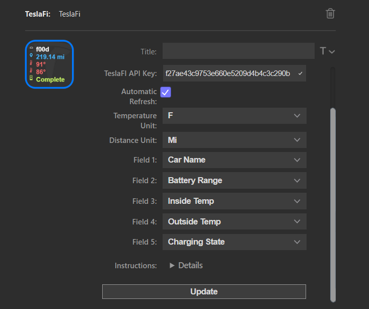

# Tesla Status Plugin for Elgato Streamdeck

View your Tesla Data using the TeslaFi API or TeslaMate.

Tesla Status is on the Elgato Marketplace! [View on Marketplace](https://marketplace.elgato.com/product/teslafi-653b2ad6-741a-4dd9-8788-0a264dcbe65a).

## Screenshot



Please report any issues you see on the project's Github page. I welcome any feedback.

## Features

- **Customizable Display:** Choose five fields to display on the Stream Deck from options including Car Name, Inside Temp, Battery Range, Charging State, Outside Temp, Odometer, and Estimated Range.
- **Real-Time Updates:** Automatically refresh data every 20 minutes to keep your display current.
- **Unit Conversions:** Select temperature unit (Fahrenheit/Celsius) and distance unit (Miles/Kilometers) based on your preference.
- **Error Handling:** Displays an API limit error message when most values return as `N/A,` indicating the need to wait 5 minutes to clear the limit.
- **Translations:** User interface is available in English, German, and Spanish.

## Installation

Download from the [Release Folder](Release/com.f00d4tehg0dz.tesla-status.streamDeckPlugin).

Double-click to install Tesla Status to theStreamDeck.

If you want to use TeslaFI
Please ensure you have an active subscription with [TeslaFi](https://teslafi.com) and enable your API key.

If you want to use TeslaMate
- Make sure you have the software installed locally [TeslaMate](https://github.com/teslamate-org/teslamate)
- Make sure to enable WebSockets in your `config.` Port 9001 is automatically inserted.

   >For docker user, you will need to add port and config file into your docker-compose.yml
   >```yml
   >mosquitto:
   >  image: eclipse-mosquitto:2
   >  container_name: "mosquitto"
   >  restart: always
   >  command: mosquitto -c /mosquitto-no-auth.conf
   >  ports:
   >    - "1883:1883"
   >    - "9001:9001"
   >  volumes:
   >    - ./mosquitto-no-auth.conf:/mosquitto-no-auth.conf # Add `mosquitto-no-auth.conf` file and bind.
   >    - mosquitto-conf:/mosquitto/config
   >    - mosquitto-data:/mosquitto/data
   >  ```
   > The 9001 port must be opened, and websockets should be used.
   >
   > The content of `mosquitto-no-auth.conf` is as follows:
   > ```bash
   > listener 1883
   > protocol mqtt
   >
   > listener 9001
   > protocol websockets
   >
   > allow_anonymous true #Option
   >```

### Configuration

(Choose TeslaFI or TeslaMate)

1. **TeslaFI API Key:** Enter your TeslaFi API key to start fetching data.
2. **TeslaMate Base URL:** Enter your TeslaMate base URL to start fetching data.
3. **Automatic Refresh:** Enable or disable automatic data refresh every 20 minutes.
4. **Temperature Unit:** Select between Fahrenheit (F) and Celsius (C).
5. **Distance Unit:** Select between Miles (Mi) and Kilometers (Km).
6. **Custom Fields:** Choose which five fields to display on your Stream Deck. I've included the full List below.
   1. **Car Name:** Display the name of your Tesla vehicle.
   2. **Inside Temp:** Display the current inside temperature.
   3. **Battery Range:** Display the current battery range.
   4. **Charging State:** Display the current charging state.
   5. **Outside Temp:** Display the current outside temperature.
   6. **Odometer:** Display the current odometer.
   7. **Estimated Range:** Display the estimated range.

## Localization

The plugin supports the following languages:
- English
- German
- Spanish

To switch the language, adjust the language settings in the configuration file.

## Contributing

Feel free to contribute to this project by submitting issues or pull requests on the [Github page](https://github.com/f00d4tehg0dz/Tesla-Status-Plugin-for-Eglato-Streamdeck).

## License

This project is licensed under the MIT License. Please look at the [LICENSE](LICENSE) file for details.

---

Thank you for using the Tesla Status Plugin for Elgato Streamdeck! We appreciate your feedback and support.

